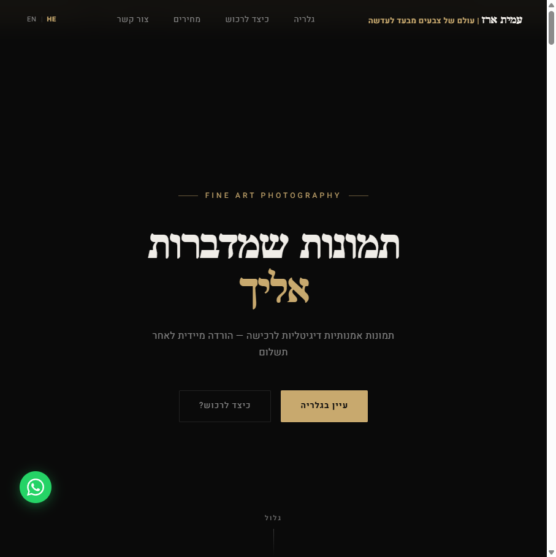
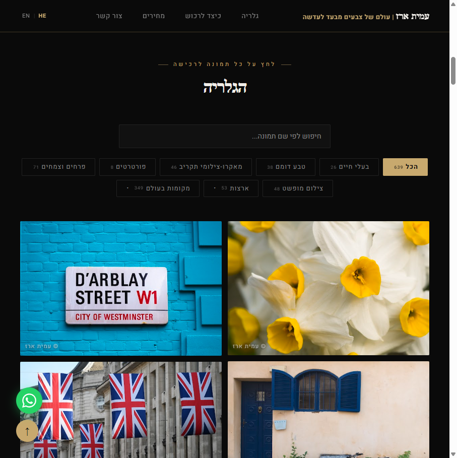
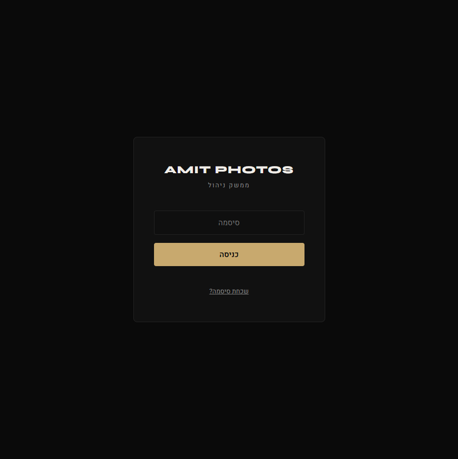

# מדריך הפעלה — amitphotos.com

> **למי המדריך הזה:** לעמית — הסבר מלא על כל מה שקיים במערכת, איך לתפעל אותה, ומה כל כפתור עושה.
>
> עודכן: 2026-04-19

---

## תוכן עניינים

1. [האתר הציבורי](#האתר-הציבורי)
2. [ממשק הניהול — Admin](#ממשק-הניהול)
3. [תמונת השבוע](#תמונת-השבוע)
4. [מערכת המחירים](#מערכת-המחירים)
5. [מערכת הרכישה הדיגיטלית](#מערכת-הרכישה-הדיגיטלית)
6. [ניהול תמונות](#ניהול-תמונות)
7. [הדפסות](#הדפסות)
8. [אוטומציות סושיאל](#אוטומציות-סושיאל)

---

## האתר הציבורי

### גלריה (`amitphotos.com`)



#### סרגל סינון



| כפתור | מה עושה |
|--------|---------|
| **הכל** | מציג את כל התמונות — תמונות עם סדר ידני קודם, שאר אקראי לפי שבוע |
| **✦ חדש** | תמונות שסומנו "חדש" ב-admin |
| **🏷 מבצע** | תמונות שמחיר ה-override שלהן נמוך ממחיר ברירת המחדל |
| **קטגוריות** | סינון לפי קטגוריה |
| **מקומות בעולם** | תפריטי dropdown עם תתי-קטגוריות לפי מדינה |

> **טיפ:** ניתן לשתף קישור ישיר לפילטר — למשל `amitphotos.com/#filter-new` יפתח ישירות עם הפילטר "חדש".

#### סטריפ תמונת השבוע ⭐

מופיע **מעל הגלריה** כשיש תמונת שבוע מוגדרת:

- שורה עם תמונה ממוזערת + שם התמונה + "25% הנחה השבוע על כל גדלי הרכישה"
- **"הצג תמונה ▼"** — פותח אזור מורחב עם התמונה בגדול
- באזור המורחב מופיעים שני כפתורים:
  - **"🖼 תצוגה על הקיר"** — מודל להדמיית התמונה תלויה על קיר (ניתן לשנות צבע קיר)
  - **"רכוש עכשיו"** — פותח מודאל רכישה עם ההנחה מוחלת
- בכרטיס בגלריה מופיע badge ⭐ על התמונה

#### רכישה מהגלריה

על כל כרטיס תמונה:

- **`+ סל`** — מוסיף לסל (לרכישת מספר תמונות יחד, עם 10% הנחה מ-3 תמונות ומעלה)
- **`רכישה ←`** — פותח מודאל רכישה מיידית

#### Lightbox

לחיצה על תמונה פותח Lightbox עם:

- ניווט עם חצים / מקלדת
- תמונות קשורות מאותה קטגוריה
- שיתוף WhatsApp / Facebook
- **"ראה על הקיר"** — מודל wall-mockup עם בחירת צבע קיר
- **"הוסף לסל"** — לרכישת הדפסה

---

## ממשק הניהול

### כניסה



- **כתובת:** `amitphotos.com/admin`
- **סיסמה:** מוגדרת ב-Cloudflare Workers → Secrets → `ADMIN_PASSWORD`
- שכחת סיסמה? לחץ "שכחת סיסמה?" → קישור לאיפוס יישלח ל-`ADMIN_EMAIL`

> הסשן נשמר ב-cookie. במצב אינקוגניטו תצטרך להתחבר שוב.

---

### לשוניות ה-Admin

#### 📊 לוח בקרה (Dashboard)

- סטטיסטיקות: צפיות, מנויים, לקוחות
- ניתוח גאוגרפי: מאיפה מגיעים המבקרים
- ביצועי רשתות חברתיות

---

#### 🖼 תמונות (Photos)

זה הלב של המערכת.

##### שורת הכלים העליונה

| פקד | מה עושה |
|-----|---------|
| **חיפוש** | חיפוש חופשי לפי שם תמונה |
| **dropdown קטגוריה** | סינון לפי קטגוריה |
| **בחירה מרובה** | מצב bulk — סימון כמה תמונות → פעולה על כולן |
| **ייצוא JSON** | מוריד גיבוי של כל נתוני התמונות |
| **ייבוא JSON** | משחזר מגיבוי |

##### מחירי הורדה גלובליים

```
מחירי הורדה (₪):   קטנה [19]   בינונית [59]   גדולה [129]   [שמור]
```

- אלה מחירי ברירת המחדל לכל התמונות
- לחיצה על **שמור** — כל רכישה עתידית תשתמש במחיר החדש
- תמונות עם מחיר מיוחד (override) **לא מושפעות**

##### כרטיסיות תמונות

כל תמונה מוצגת כקלף עם:

- תמונה ממוזערת
- שם + קטגוריה
- תג **"טיוטה"** אם לא פורסמה
- תג **"🏷 מבצע"** אם יש override נמוך מהגלובלי

##### כפתורי פעולה על כל תמונה

| אייקון | מה עושה |
|--------|---------|
| **📋 (העתק ID)** | מעתיק את ה-ID הייחודי ללוח |
| **₪ (מחיר)** | פותח popup להגדרת מחיר מיוחד. **כחול = יש override פעיל** |
| **★ (חדש)** | מסמן/מסיר תג "חדש". **זהוב = מסומן** |
| **↕ (גרור)** | גרור לשינוי סדר הופעה בגלריה |
| **✏️ (עריכה)** | פאנל עריכה: שם, קטגוריה, תיאור |
| **🗑️ (מחיקה)** | מחיקה מ-D1 ומ-R2 |

##### Popup מחיר מיוחד

```
מחיר מיוחד לתמונה זו (₪)
קטנה    [ 19 ]
בינונית [ 59 ]
גדולה   [ 129 ]
[עדכן מחירים]  [אפס]
```

- **עדכן מחירים** — שומר override; כפתור ₪ יהפוך כחול, תג 🏷 מבצע יופיע בגלריה
- **אפס** — מוחק override, חוזר למחיר גלובלי

##### מצב בחירה מרובה (Bulk)

לחץ "בחירה מרובה" → מופיע checkbox על כל כרטיס → בחר תמונות → בחר פעולה:

- **שנה קטגוריה** — שינוי קטגוריה לכולן
- **הגדר מחיר** — override אחיד לכולן
- **מחק נבחרים** — מחיקה מרובה

##### סדר ידני

גרור כרטיסים לסדר הרצוי. תמונות עם `sort_order` מוצגות ראשון בגלריה לפי הסדר שקבעת.

---

## תמונת השבוע

### סקשן "תמונת השבוע" ב-Admin

**מטרה:** לבחור תמונה שתקבל הנחה מיוחדת ובולטת בראש הגלריה.

#### זרימת עבודה

```
לחץ "הצע תמונה" ← המערכת בוחרת אקראית מ-20% הפחות נמכרות
    ↓
התמונה מוצגת לתצוגה מקדימה
    ↓
"אשר" — מגדיר כתמונת השבוע  /  "הצע שוב" — מקבל הצעה אחרת
    ↓
הסטריפ מופיע אוטומטית בראש הגלריה הציבורית
```

#### כפתורים

| כפתור | מה עושה |
|--------|---------|
| **הצע תמונה** | בוחר תמונה אקראית מ-20% הפחות נמכרות |
| **אשר** | מגדיר את התמונה המוצעת כתמונת השבוע |
| **הצע שוב** | מגריל תמונה אחרת |
| **נקה** (אדום) | מסיר את תמונת השבוע — הסטריפ נעלם מהאתר |

#### מה מקבלת תמונת השבוע?

- הנחה של **25%** על כל גדלי ההורדה הדיגיטלית (small/medium/large)
- סטריפ בולט מעל הגלריה עם כפתורי "הצג תמונה" ו-"רכוש עכשיו"
- Badge ⭐ על הכרטיס שלה בגלריה
- ההנחה מוחלת אוטומטית במודאל הרכישה

---

#### תצוגה על הקיר

כשמרחיבים את הסטריפ ולוחצים **"🖼 תצוגה על הקיר"**, נפתח מודל שמדמה את התמונה תלויה על קיר:

- ניתן לשנות את **צבע הקיר** עם color picker
- מופיע כיתוב "לצורך המחשה בלבד"
- סגירה: לחץ ✕ / Escape / מחוץ למודל

---

## מערכת המחירים

### היררכיה

```
מחיר גלובלי (settings)
    ↓  ברירת מחדל לכל התמונות
    ↓  ניתן לדריסה על-ידי:
מחיר מיוחד לתמונה (price_overrides)
    ↓  {"small": X, "medium": Y, "large": Z}
    ↓  ניתן להנחה נוספת על-ידי:
הנחת תמונת השבוע (-25%)
```

### גדלים

| גודל | שם | מחיר ברירת מחדל | שימוש |
|------|----|-----------------|-------|
| small | קובץ רשת | ₪19 | סושיאל, אינטרנט |
| medium | קובץ הדפסה | ₪59 | הדפסה ביתית |
| large | קובץ מלא | ₪129 | הדפסה מקצועית, גדול |

### שינוי מחיר גלובלי

Admin → Photos → שורת "מחירי הורדה" → שנה מספר → שמור

### שינוי מחיר לתמונה בודדת

Admin → Photos → לחץ ₪ על הכרטיס → הזן מחירים → עדכן

---

## מערכת הרכישה הדיגיטלית

### זרימה מלאה

```
לקוח לוחץ "רכישה" בגלריה
    ↓
מודאל בחירת גודל (קטן / בינוני / גדול) + מחיר
    ↓
PayPal — תשלום מאובטח
    ↓
Worker מאמת: סכום תואם + חשבון נכון + מטבע ILS
    ↓
Worker יוצר download token (תוקף 24 שעות)
    ↓
שולח מייל עם קישור הורדה → לקוח + עמית
    ↓
שולח הודעת Telegram לעמית
    ↓
לקוח מוריד קובץ
```

### הנחת חבילה

3+ תמונות בסל → הנחה אוטומטית של **10%** על כל הסכום.

### טוקן הורדה

- תקף ל-**24 שעות** מרגע הרכישה
- חד-פעמי — לא ניתן להוריד פעמיים
- Admin יכול ליצור טוקן ידני מלשונית "רכישות"

---

## ניהול תמונות

### מקורות תמונה

| מקור | איך עובד |
|------|---------|
| **R2** | תמונה מועלת ישירות ל-Cloudflare R2. הקובץ שלך, מהיר, יציב. |
| **Google Drive** | URL מ-Google Photos. אם Google מגביל גישה — התמונה לא נגישה. |

### הוספת תמונה

Admin → Photos → "הוסף תמונה" → מלא שם, קטגוריה, העלה קובץ

### פרסום / הסתרה

- **פורסם** — מופיע בגלריה הציבורית
- **טיוטה** — גלוי רק ב-admin

### סדר בגלריה

1. תמונות עם `sort_order` — מוצגות ראשון לפי הסדר שנקבע בגרירה
2. שאר התמונות — אקראי שמתחלף כל שבוע (עקבי בתוך השבוע)

---

## הדפסות

### תהליך הזמנה (מצד הלקוח)

1. Lightbox → "הוסף לסל" → בחירת מוצר + גודל
2. crop tool + בדיקת רזולוציה
3. פרטי משלוח + PayPal
4. מייל אישור + קישור ביטול
5. Gelato מייצר ומשלח
6. מייל שילוח אוטומטי

### ניהול הזמנות (Admin → הדפסות)

| עמודה | הסבר |
|-------|-------|
| **תאריך** | מתי הוזמן |
| **לקוח** | שם + מייל + טלפון |
| **מוצר** | סוג + גודל + תמונה |
| **מחיר** | בדולרים |
| **Gelato ID** | מזהה להזמנה ב-Gelato |
| **סטטוס** | pending / in_production / shipped / cancelled |

- **🔄 רענן סטטוס** — שולף עדכון מ-Gelato עבור הזמנות `in_production`
- **החזר ב-PayPal** — מוצג עבור הזמנות מבוטלות שטרם הוחזרו

---

## אוטומציות סושיאל

### לוח זמנים

| פלטפורמה | ימים | שעה |
|-----------|------|------|
| Instagram | ראשון, רביעי, שישי | 12:00 |
| Facebook | שלישי, שישי | 11:00 |
| Pinterest | כל יום | 10:00 |

### איך זה עובד

1. GitHub Actions מתעורר לפי לוח הזמנים
2. בוחר תמונה שלא פורסמה ברשת זו עדיין
3. **Claude Vision** מנתח את התמונה וכותב כיתוב + hashtags
4. מפרסם דרך API של הפלטפורמה
5. שומר את ה-ID כדי שלא יפורסם שוב

### Anti-repeat

כל פלטפורמה שומרת רשימת IDs שפורסמו (`instagram_posted.json` וכו'). תמונה לא תפורסם שוב עד שתמה הרוטציה.

---

## תחזוקה

### אם האתר לא עולה

1. `dash.cloudflare.com` → Workers → amit-photos → לוגים
2. בדוק DNS: Worker record + CNAME ל-www

### גיבוי

- **JSON Export** ב-admin שומר כל מטא-דאטה
- הקבצים עצמם שמורים ב-R2 (Cloudflare)

### פרסום שינויים בקוד

כל שינוי ב-`worker.js` מתפרסם אוטומטית ב-GitHub Actions.

---

*מסמך זה עודכן: אפריל 2026*
