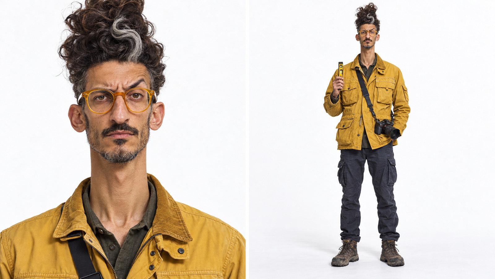

# פקח הפריים — דמות הקמפיין של Amit Photos

## קובץ ייחוס


תמונת סטודיו על רקע לבן: משמאל תקריב פנים, מימין גוף מלא של אותה דמות. זהו מקור הייחוס המרכזי לזהות החזותית בסרטונים ובתמונות קמפיין. הדמות סינתטית ואינה אדם אמיתי.

## זהות ואופי
- גבר טרנס בן כ־43, צלם ו״מפקח פריימים״ מטעם עצמו.
- רציני עד כדי גיחוך בענייני קומפוזיציה. בודק קו אופק בעזרת פלס זעיר, מתעכב על זוויות ושומר על הומור יבש. הזהות הטרנסית איננה הפאנץ׳.
- תפקיד שיווקי: למשוך תשומת לב בסיטואציה משעשעת, ואז להפנות את המבט לצילומים של עמית ולגלריות באתר. אין להציג את תמונת הדמות עצמה כצילום מהפורטפוליו.

## עוגנים חזותיים שאסור לאבד
פנים ים־תיכוניות, צוואר ארוך ודק, שיער חום כהה גבוה ומפותל עם פס כסוף, אוזניים מעט בולטות, אף בולט, משקפיים עגולים צהובים, הבעת ביקורת יבשה. מעיל צלמים חרדל עם כיסים, מכנסי מטען כהים, נעלי שטח משומשות, מצלמה ופלס קטן. לשמור על אותם תווי פנים, תסרוקת ובגדים בכל שוט; אפשר לשנות הבעות ותנוחות.

## שימוש בהפקת סרטון
1. להתחיל מן התמונה הזו כרפרנס לזהות. בכל יצירה להדגיש: same person in both panels; preserve face, hair, neck, glasses and jacket.
2. לצלם/לייצר 9:16 במראה פוטוריאליסטי, תנועות גוף ופנים עדינות, עור ובד טבעיים, בלי שינוי זהות בין שוטים. רעיון פתיחה: הוא מודד אופק בעזרת פלס זעיר.
3. אחרי רגע קומי קצר להציג צילום אמיתי שנבחר מ־Amit Photos, עם קרדיט וקישור מתאים.
4. להוסיף דיבור עברי גברי בהקלטה/קריינות נפרדת. להוסיף כתוביות בעברית ושקופית סיום בעריכה, כטקסט גרפי מדויק ולא טקסט שמודל הווידאו מייצר. יעד האתר: `https://amitphotos.com`; לא להציג כתובת אחרת.
5. לשמור בפרויקט גם את קובץ המקור של העריכה, תסריט, קריינות וקובץ MP4 סופי של כל סרטון עתידי.

## פרומפט בסיס באנגלית
```text
Use the provided character reference sheet as the identity anchor. A photorealistic recurring 43-year-old male photographer, same distinctive Middle Eastern face, very long slender neck, towering dark corkscrew hair with one silver streak, round amber-yellow glasses, mustard photographer jacket, navy cargo trousers, worn hiking boots and camera. He seriously checks a horizon with a tiny spirit level. Deadpan visual comedy, natural skin and fabric texture, believable body and hands, consistent face and outfit, vertical 9:16 cinematic editorial photography. No cartoon, CGI, plastic skin, extra fingers, captions, logos or generated text.
```

סטטוס: דמות ייחוס מאושרת כבסיס יצירתי. יצירת הסרטונים והפרסום הם שלבים נפרדים.