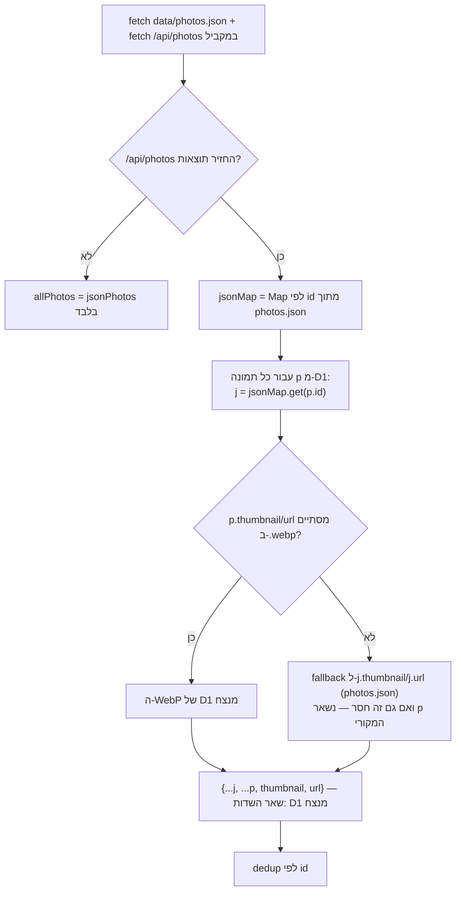

# ארכיטקטורת מיזוג הגלריה — D1 + photos.json

> דוגמה לסוג המסמך ש-Markdown Preview Enhanced נועד עבורו: תיעוד טכני שהיה עד היום רק פסקת טקסט ב-CLAUDE.md, עם דיאגרמת Mermaid במקום להסביר במילים.

## הממצא

בבדיקת [assets/js/gallery.js:220-244](../assets/js/gallery.js#L220-L244) מול התיאור הקיים ב-CLAUDE.md נמצא **פער בין התיעוד לקוד בפועל**, בכלל ה-`thumbnail`/`url`:

| | מה CLAUDE.md אומר | מה הקוד בפועל עושה |
|---|---|---|
| כלל | "thumbnail/url — **photos.json מנצח** על D1 (אם קיים ב-JSON)" | **D1 מנצח — אבל רק אם ה-WebP שלו קיים.** photos.json הוא fallback, לא ברירת המחדל |
| מקור | תיאור מילולי בטבלת "כלל מיזוג" | `gallery.js:233-236`, עם הערה מפורשת בקוד: `// D1 WebP wins; JSON URL/thumbnail only as fallback when D1 has no WebP` |

כלומר התיעוד הקיים תיאר גרסה קודמת של הלוגיקה — הקוד התפתח (עדיפות ל-WebP מ-D1) בלי שהתיעוד התעדכן.

## זרימת ההחלטה בפועל

## המלצה

לעדכן את הפסקה "כלל מיזוג" ב-CLAUDE.md כך שתשקף את עדיפות ה-WebP, לא רק "photos.json מנצח". זה בדיוק סוג התיקון הקטן שקל לפספס בלי לקרוא את הקוד שורה-שורה — ותיעוד ארכיטקטורה עם דיאגרמת החלטה חיה (ולא רק טקסט) הופך אותו לגלוי יותר בפעם הבאה שמישהו קורא את זה.

---

*נכתב כדוגמה חיה ל-.crossnote/style.less — לתצוגה מלאה עם RTL וצבעי המותג: פתח את הקובץ הזה ב-VS Code ולחץ Ctrl+Shift+V.*
